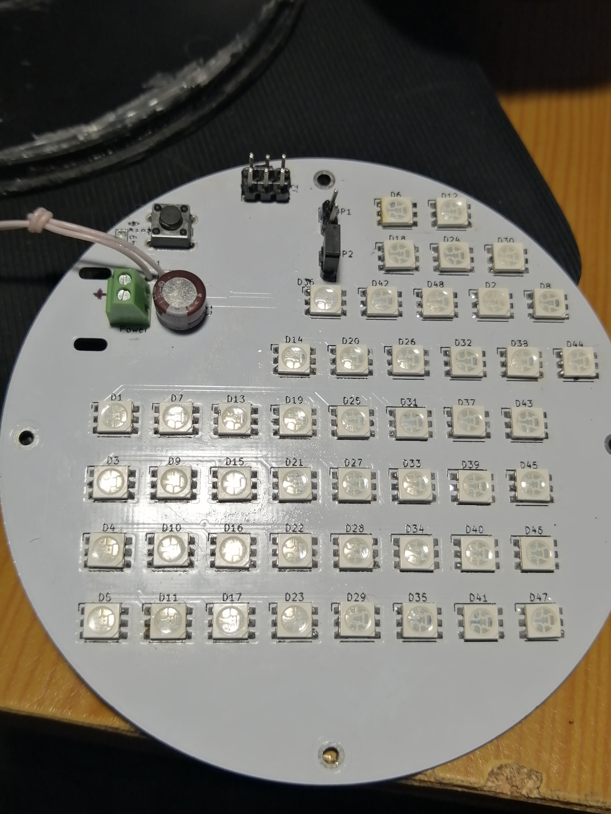
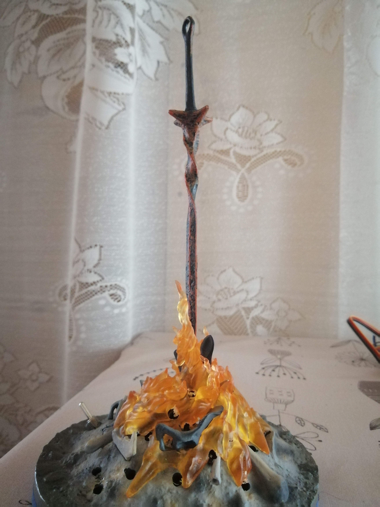
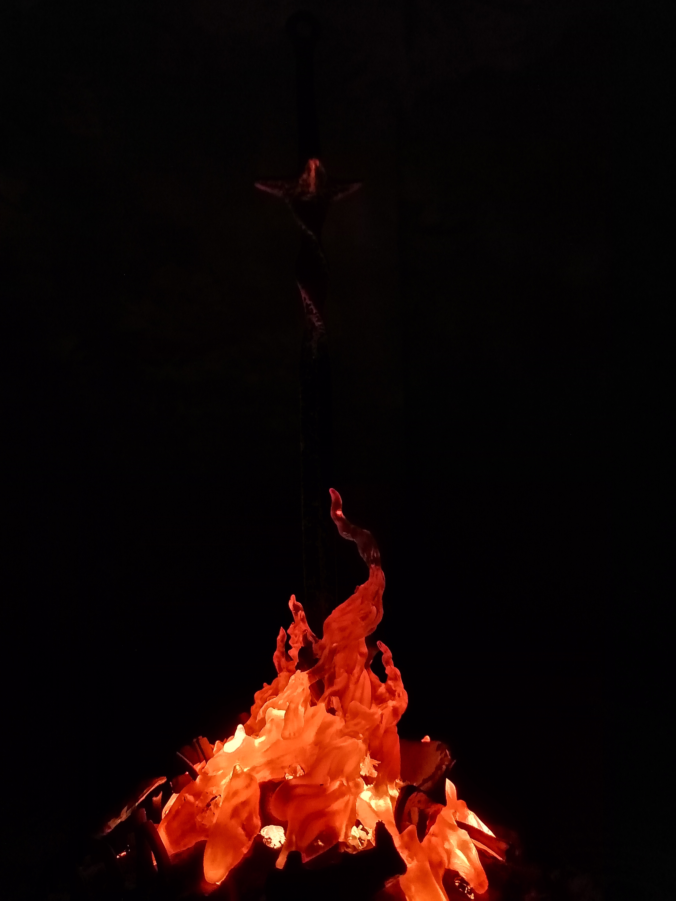
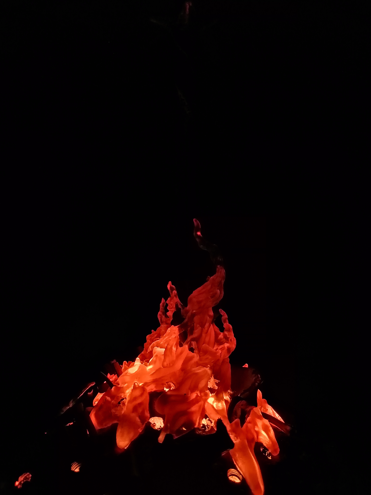
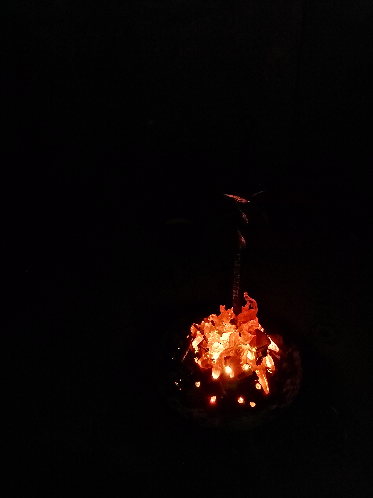

# bonfire
Modernization of the night light bought on Ali in the form of a bonfire from Dark Souls.
The original uses three 5050 RGB LEDs with IR remote control. The range of this control is +- 50 centimeters, you can choose several glow colors. I created a new board to replace the one that was there, without control, just a glow in the form of a fluttering flame (it seems to work). The blue color of the diodes is not used, the red one works constantly, and green, with a PWM, turns out to be flickering yellow, creating the effect of a flame. Everything is controlled by one 48 mega, 6 PWM channels, each controls its own transistor, each has 8 LEDs.

Board size: circle, diameter 98 mm.
v0.1:
1. no remote control (why? It's a fire);
2. instead of 3 LEDs, now 48;
3. work from an external 5V source;
4. consumption about 350mA.

***
## scheme:
### scheme_v0.1:
[pdf](docs/scheme_v0.1.pdf)

***
## pcb:
#### top assambled:

***
## bonfire:
#### assambled:

#### work:

***
## gerber:
Archive for production:
[gerber_v0.1](https://github.com/piro-s/bonfire/raw/master/gerber/bonfire_v0.1.zip)
